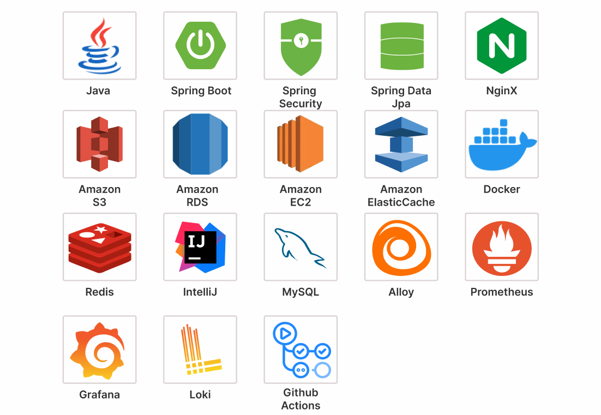
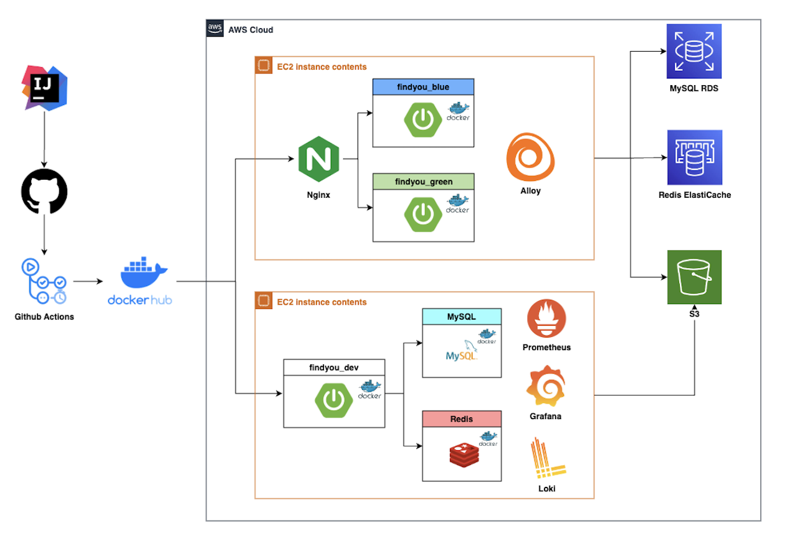
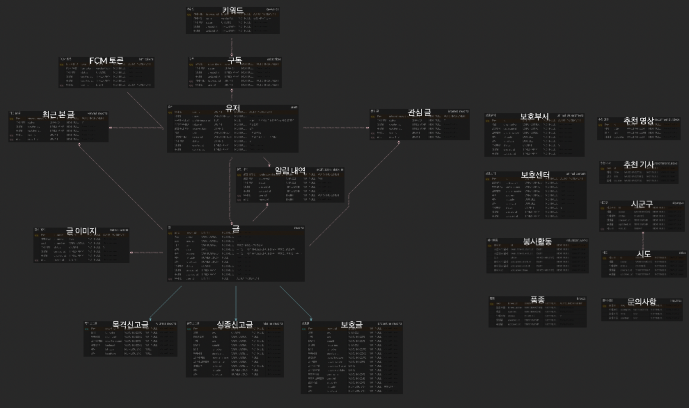

# 찾아유 - 유기동물 관련 종합 애플리케이션

## 👋 Project Overview
**WHAT?**  
유실동물을 찾고 보호하는 것을 돕는 통합 플랫폼입니다. 실종 신고, 목격 제보부터 보호 센터 정보, AI 품종 분석까지 반려동물을 잃어버린 슬픔을 덜고 빠른 구조를 돕습니다.

**HOW?**  
공공데이터 포털의 전국 유기동물/보호소 데이터와 사용자의 실시간 제보(위치, 사진)를 매핑하여 지도 기반 서비스를 제공합니다. OpenAI 기반의 품종 자동 분석을 도입하여 검색 정확도를 높였습니다.

**WHY?**  
가족 같은 반려동물을 잃어버렸을 때의 막막함을 해소하고, 골든타임을 놓치지 않도록 기술적으로 지원하며, 나아가 성숙한 반려동물 문화를 만들기 위해 시작되었습니다.

<br>

## 🧑‍🧑‍🧒 Team Member
<table>
  <tbody>
    <tr>
      <td align="center"><a href="https://github.com/JangIkhwan">
      <br />
      <sub><b>[Server] 장익환</b></sub></a><br /></td>
      <td align="center"><a href="https://github.com/ksg1227">
      <br />
      <sub><b>[Server] 김상균</b></sub></a><br /></td>
      <td align="center"><a href="https://github.com/JJUYAAA">
      <br />
      <sub><b>[Server] 정주연</b></sub></a><br /></td>
    </tr>
  </tbody>
</table>

<br>

## ⚒️ Tech Stack


### Backend
| Tech | Version / Description |
| --- | --- |
| **Java** | JDK 17 |
| **Spring Boot** | 3.5.0 |
| **Spring Data JPA** | ORM / Hibernate |
| **Spring Security** | Authentication & Authorization |
| **Spring AI** | OpenAI (GPT-4o) Integration |
| **Gradle** | Build Tool |

### Database & Storage
| Tech | Description |
| --- | --- |
| **MySQL** | Main RDBMS (v8.0) |
| **Redis** | Cache & Session Store |
| **Flyway** | DB Migration Tool |
| **AWS S3** | Image Storage |

### Infra & DevOps
| Tech | Description |
| --- | --- |
| **Docker** | Containerization |
| **AWS EC2** | (Expected Deployment Target) |
| **GitHub Actions** | CI/CD (Workflows configured) |

### Tools
- **Swagger (OpenAPI)**: API Documentation
- **Actuator & Prometheus/Loki/Grafana/Alloy**: Monitoring

<br>

## 🏗️ Architecture


<br>

## 📍 ERD


<br>

## 📜 Convention

### Code Convention
| 항목 | 규칙 | 예시 |
| --- | --- | --- |
| **Class** | PascalCase | `UserProfile` |
| **Function** | camelCase | `getUserInfo` |
| **Variable** | camelCase | `userId` |
| **DB Table** | snake_case | `user_profile` |
| **Enum / Constant** | PascalCase / UPPER_SNAKE_CASE | `UserStatus`, `MAX_RETRY` |

### Git Convention

#### Commit Message
`[Prefix] #IssueNumber Description`  
예시: `[Feat] #123 로그인 API 구현`

| Prefix | Description |
| --- | --- |
| `Feat` | 새로운 기능 추가 |
| `Fix` | 버그 수정 |
| `Refactor` | 코드 리팩토링 |
| `Chore` | 빌드 업무 수정, 패키지 매니저 수정 |
| `Docs` | 문서 수정 |
| `Infra` | 인프라 설정 |
| `Test` | 테스트 코드 |

#### Branch Strategy
`prefix/#issue-description`
예시: `feat/#123-login-api`, `fix/#45-bug-fix`

<br>

## 🗂️ Project Structure
```
com.kuit.findyou
├── 📂 domain              // 도메인별 비즈니스 로직 (Feature Packaging)
│   ├── 📂 auth            // 인증 (Login, Token)
│   ├── 📂 breed           // 품종 정보
│   ├── 📂 city            // 시/도, 시/군/구 지역 정보
│   ├── 📂 home            // 홈 화면 (통계, 추천)
│   ├── 📂 image           // 이미지 업로드/처리
│   ├── 📂 information     // 동물보호센터, 봉사활동 정보
│   ├── 📂 inquiry         // 문의하기
│   ├── 📂 notification    // 알림
│   ├── 📂 report          // 실종/목격 신고
│   └── 📂 user            // 사용자 관리 (MyPage)
│
└── 📂 global              // 전역 공유 모듈
    ├── 📂 common          // 공통 Response, Exception
    ├── 📂 config          // 설정 (Security, Swagger, S3, Redis...)
    ├── 📂 external        // 외부 API 클라이언트 (Kakao, Public Data...)
    ├── 📂 infrastructure  // 인프라 구현체 (ImageUploader...)
    ├── 📂 jwt             // JWT 관련 유틸리티 및 필터
    └── 📂 logging         // 로깅 설정
```